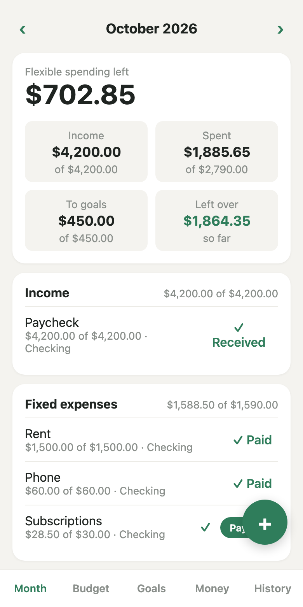
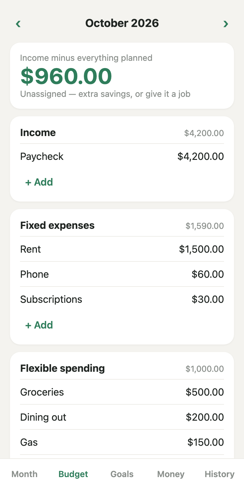
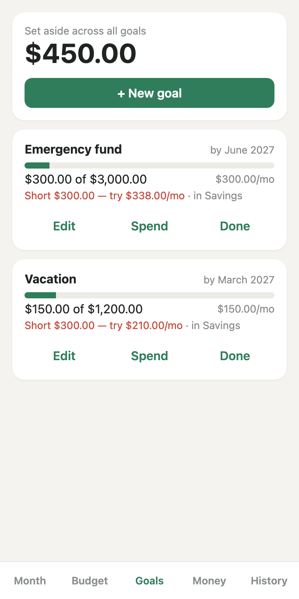
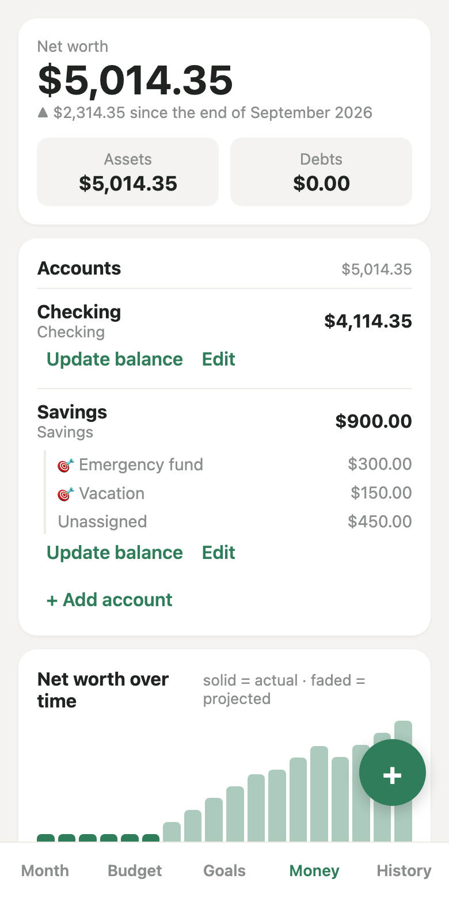
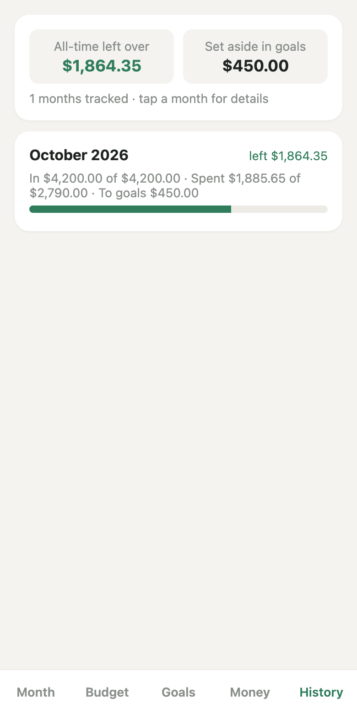
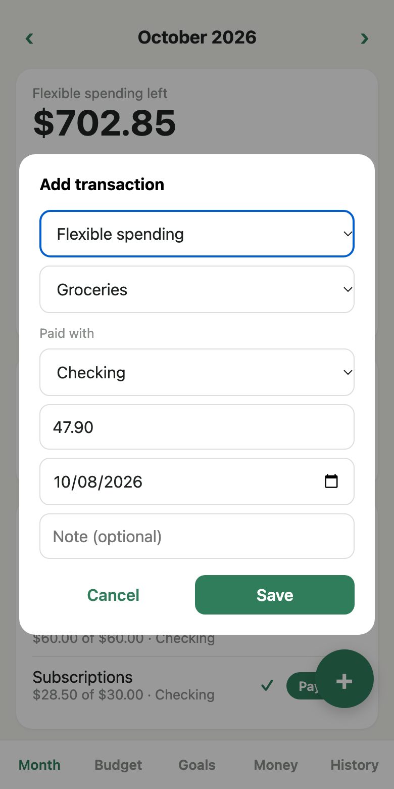

# Personal Budget (Google Sheets + Apps Script)

A private, free, mobile-friendly budgeting app. Your data lives in **your own Google Sheet**, and a small web app (Google Apps Script) gives you a clean interface to add spending, plan your month, track goals, and manage accounts. No servers, no subscriptions, no third parties.

**Live demo (read-only):** [Web app](https://script.google.com/macros/s/AKfycbx9VwvqqKhafa0KZbd99lyfGuHjiX4OEUaDxxplJzeT-pbc7Hjh6urOOhm-F9qkrngixA/exec) · [Example sheet](https://docs.google.com/spreadsheets/d/1EXbgm8oBR7yjrrUnXLtKS9_Rk5gmm4R7UqK5_yGZLmA/edit?usp=sharing)

## What you get

Five tabs along the bottom of the app:

| Tab | What it does |
|---|---|
| **Month** | Planned vs. actual for the current month |
| **Budget** | Your plan: income, fixed, flexible, unplanned buffer, savings |
| **Goals** | Savings goals with targets and due dates |
| **Money** | Your accounts (checking, savings, etc.) and balances |
| **History** | Every transaction, editable, with undo |

The **+** button adds a transaction in a couple of taps.

| Month | Budget | Goals |
|:---:|:---:|:---:|
|  |  |  |

| Money | History | Add a transaction |
|:---:|:---:|:---:|
|  |  |  |

*Screenshots use sample data.*

## Setup (about 5 minutes)

1. **Create a Google Sheet.** Go to [sheets.new](https://sheets.new). It can be empty. Name it anything.
2. **Copy the Sheet ID.** It's the long string in the URL:
   `docs.google.com/spreadsheets/d/`**`THIS_PART`**`/edit`
3. **Create the script.** In the Sheet, open **Extensions → Apps Script**.
4. **Add the code.**
   - Replace the contents of `Code.gs` with this repo's [Code.gs](Code.gs).
   - Click **+ → HTML**, name it exactly `Index` (capital I), and paste in [Index.html](Index.html).
5. **Set your Sheet ID.** On line 1 of `Code.gs`, replace `'SheetID'` with your ID:
   ```js
   const SHEET_ID = 'your-long-id-here';
   ```
6. **Run setup once.** Pick `setup` in the function dropdown and click **Run**. Approve the permissions prompt (you may need to click *Advanced → Go to project* since it's your own unverified script). This creates the `Budget`, `Transactions`, `Goals`, `Accounts`, and `Log` sheets with starter categories.
7. **Deploy.** Click **Deploy → New deployment → Web app**:
   - **Execute as / Who has access:** pick a combination from [Privacy and sharing](#privacy-and-sharing) below. **Don't** pair "Execute as: Me" with "Anyone", or strangers can edit your sheet.
8. **Open the web app URL** it gives you, and bookmark it. On your phone, use *Add to Home Screen* to make it feel like an app.

> After editing code later, use **Deploy → Manage deployments → Edit (pencil) → New version** so your URL stays the same. If you update the app, re-run `setup`; it's safe to re-run and won't erase data.

## Using it

- **Plan first:** On **Budget**, set income and expected spending. Items can repeat monthly or be one-off.
- **Log as you go:** Tap **+**, pick a type, amount, category, and account.
- **Check in:** **Month** shows how you're tracking against the plan.
- **Mistakes happen:** Edit or delete from **History**, or tap **Undo** right after a change.

## Privacy and sharing

The deployment's **Who has access** setting plus the Sheet's own sharing control who can see and change your data.

| Execute as | Who has access | Result |
|---|---|---|
| Me | Only myself | Most private. Right for solo use. |
| **User accessing the web app** | Anyone with a Google account | Each visitor acts as themselves, so **Sheet sharing decides what they can do**: Editor can change data, Viewer is read-only, no access means no data. This is how the live demo works (read-only to everyone but the owner). Visitors approve a permissions prompt on first visit. |
| Me | Anyone | **Unsafe.** Anyone with the link can read and write your sheet as you. |

Want a shared household budget? Share the Sheet with them as **Editor**.

Your data stays in your Google account. The `Log` sheet records who changed what and when, including email addresses. Don't make a sheet with real data public.

## Customizing

The easiest customizations need no coding:

- **Categories and budget lines:** Edit them in the app's **Budget** tab, or directly in the `Budget` sheet.
- **Starter data:** Change the `starter` list in `setup()` in `Code.gs` before the first run.
- **Accounts:** Add or rename on the **Money** tab.

For light coding:

- **Colors and look:** CSS variables are at the top of `Index.html`.
- **Budget types and labels:** `BTYPES`, `LABEL`, and `KIND` near the top of the script in `Index.html` (defaults: Income, Fixed, Flex, Unplanned, Savings).
- **Columns:** The `HEADERS` object at the top of `Code.gs` defines each sheet. Add columns at the end to avoid breaking existing data.

## Troubleshooting

| Problem | Fix |
|---|---|
| "Cannot read properties of null" | Run `setup` first, and check `SHEET_ID` is correct |
| Blank page or old version | Create a **new version** in Manage deployments |
| "Authorization required" | Re-run any function in the editor and approve permissions |
| Others see an error | Share the Sheet with them (see above) |

## Files

- `Code.gs`: server logic that reads and writes the Sheet
- `Index.html`: the interface
